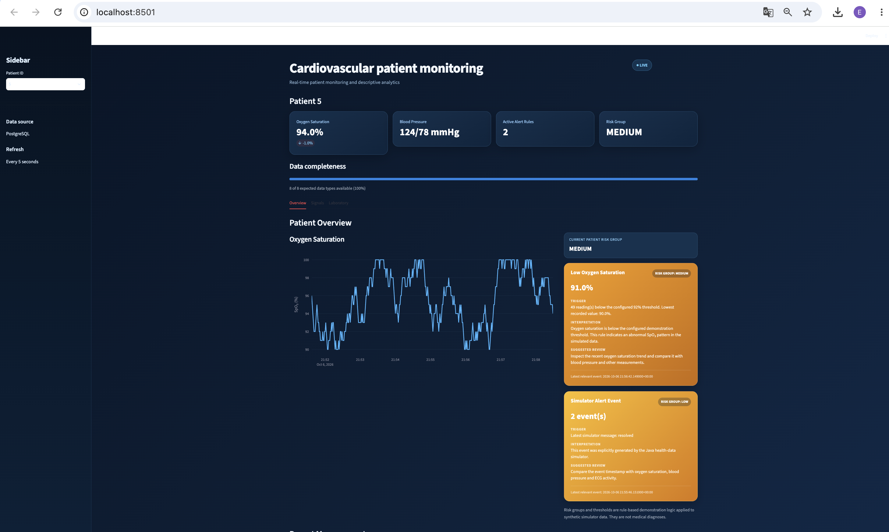

# Real-Time Cardiovascular Data Pipeline

CardioPulse is an end-to-end data pipeline for simulated cardiovascular telemetry. It generates patient measurements in Java, streams them over WebSockets as JSON, validates and stores them in PostgreSQL, and exposes the data through Python analytics and a live Streamlit dashboard.

The project demonstrates how a real-time monitoring system can be built from data generation to storage, analysis, alerting, and visualization.
Originally developed as a university team project.
This repository contains my extensions:
analytics pipeline, database integration,
dashboard, automated testing and deployment setup.
> All patient data is synthetic. The alert and risk logic is intended for software engineering and analytics demonstration only.

---

## Demo

Add a dashboard screenshot here once it is committed to the repository:

```md

```

The dashboard supports multiple simulated patients and refreshes automatically every 5 seconds.

---

## What the Project Does

The system is built as a small streaming architecture:

```text
Java Simulator
      ↓
WebSocket + JSON
      ↓
Java Consumer
      ↓
Validation
      ↓
JDBC
      ↓
PostgreSQL
      ↓
 ┌───────────────┬────────────────┐
 ↓               ↓
Python         Streamlit
Analytics      Dashboard
```

The Java simulator generates measurement events for multiple patients at different frequencies. Each event contains a patient ID, timestamp, measurement type, and measurement value.

The events are serialized to JSON and sent through a WebSocket connection. A separate Java consumer receives the stream, deserializes the JSON, validates the event, and stores valid measurements in PostgreSQL.

The stored data is then used in two ways:

- **Python analytics** for summaries, anomaly analysis, CSV exports, and plots
- **Streamlit dashboard** for patient-level monitoring and visualization

The project currently supports measurements such as:

- ECG
- Oxygen saturation
- Systolic blood pressure
- Diastolic blood pressure
- Cholesterol
- Red blood cells
- White blood cells
- Simulator-generated alerts

Key functionality includes:

- real-time event streaming with WebSockets
- JSON serialization and deserialization with Jackson
- validation before persistence
- PostgreSQL storage through JDBC
- support for multiple simulated patients
- SQL and pandas-based analysis
- automatic dashboard refresh
- interactive Plotly visualizations
- data completeness monitoring
- rule-based anomaly detection
- patient risk grouping
- alert cards with trigger, interpretation, and review context

---

## Tech Stack

**Java**
- Java
- Maven
- Java-WebSocket
- Jackson
- JDBC

**Database**
- PostgreSQL
- SQL

**Analytics**
- Python
- pandas
- SQLAlchemy
- psycopg2
- matplotlib

**Dashboard**
- Streamlit
- Plotly
- streamlit-autorefresh

---

## Dashboard

The Streamlit dashboard provides a patient-level view of the data stored in PostgreSQL.

Main dashboard features:

- patient selection
- live auto-refresh every 5 seconds
- oxygen saturation KPI
- blood pressure KPI
- active alert count
- current patient risk group
- data completeness indicator
- oxygen saturation trend
- ECG signal visualization
- systolic and diastolic blood pressure chart
- laboratory measurements
- recent measurement history
- rule-based alert center

The dashboard is divided into three main tabs:

### Overview

Shows the main patient summary, oxygen saturation trend, current risk group, alerts, and recent measurements.

### Signals

Shows time-series visualizations for:

- ECG
- oxygen saturation
- systolic blood pressure
- diastolic blood pressure

### Laboratory

Shows the latest and historical values for:

- cholesterol
- red blood cells
- white blood cells

---

## Project Structure

```text
signal_project/
├── src/
│   ├── main/
│   │   └── java/
│   │       ├── com/cardio_generator/
│   │       ├── com/cardiopipeline/
│   │       │   ├── app/
│   │       │   ├── consumer/
│   │       │   ├── model/
│   │       │   ├── storage/
│   │       │   ├── streaming/
│   │       │   └── validation/
│   │       └── com/data_management/
│   └── test/
├── database/
│   └── init.sql
├── analytics/
│   ├── analyze.py
│   ├── queries.sql
│   └── requirements.txt
├── dashboard/
│   └── app.py
├── pom.xml
└── README.md
```

---

## Database Schema

The project uses an event-based PostgreSQL schema.

Each incoming measurement is stored as a separate row:

```text
measurements
------------
id
patient_id
recorded_at
measurement_type
measurement_data
created_at
```

Example:

```text
patient_id | measurement_type  | measurement_data
-----------|-------------------|-----------------
18         | ECG               | 0.421
18         | Saturation        | 98.0%
18         | SystolicPressure  | 121
18         | DiastolicPressure | 79
```

This design allows measurements with different frequencies and different data types to be stored in the same event stream.

Indexes are created for:

- patient and timestamp lookup
- measurement type filtering

---

## How to Run

### 1. Clone the repository

```bash
git clone https://github.com/elenagos/signal_project.git
cd signal_project
```

### 2. Create the PostgreSQL database

```bash
createdb cardio_pipeline
```

Initialize the schema:

```bash
psql cardio_pipeline < database/init.sql
```

### 3. Build the Java project

```bash
mvn clean test
```

### 4. Start the simulator

Example with 20 patients:

```bash
mvn exec:java \
-Dexec.mainClass="com.cardio_generator.HealthDataSimulator" \
-Dexec.args="--patient-count 20 --output websocket:8080"
```

Keep this terminal running.

### 5. Start the consumer

Open a second terminal:

```bash
mvn exec:java \
-Dexec.mainClass="com.cardiopipeline.app.PipelineConsumerApp"
```

The consumer receives JSON events from the WebSocket stream and stores them in PostgreSQL.

### 6. Create the Python environment

Open another terminal:

```bash
python3 -m venv .venv
source .venv/bin/activate
pip install -r analytics/requirements.txt
```

### 7. Start the dashboard

```bash
streamlit run dashboard/app.py
```

Open:

```text
http://localhost:8501
```

The dashboard refreshes automatically approximately every 5 seconds.

---

## Analytics

The analytics layer reads the same PostgreSQL data used by the dashboard.

Run it with:

```bash
source .venv/bin/activate
python analytics/analyze.py
```

The analysis layer includes:

- measurement counts by type
- patient-level summaries
- descriptive statistics
- anomaly extracts
- CSV output
- time-series plots

Example SQL query:

```sql
SELECT
    patient_id,
    measurement_type,
    COUNT(*) AS measurement_count
FROM measurements
GROUP BY patient_id, measurement_type
ORDER BY patient_id, measurement_type;
```

This makes it possible to compare how much data has been generated for each patient and measurement type.

---

## Alerts and Risk Groups

The dashboard contains a rule-based alert layer built on top of the stored measurements.

Current examples include:

- low oxygen saturation
- abnormal systolic blood pressure
- abnormal diastolic blood pressure
- explicit simulator-generated alert events

Alerts are assigned a demonstration risk group:

```text
LOW
MEDIUM
HIGH
```

Each alert card can display:

- alert type
- risk group
- latest relevant value
- trigger condition
- interpretation
- suggested review
- timestamp

Example:

```text
Low Oxygen Saturation
Risk Group: MEDIUM

Latest low value: 90%
77 readings below the configured 92% threshold

Trigger:
SpO₂ < 92%

Interpretation:
The simulated oxygen saturation is outside the configured rule-based range.

Suggested review:
Compare the oxygen saturation trend with blood pressure and other measurements.
```

The risk groups are deterministic analytics rules for synthetic data and are not intended to represent medical diagnoses.

---

